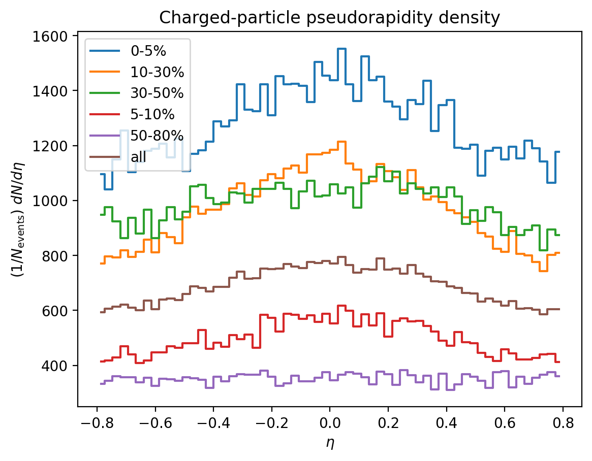
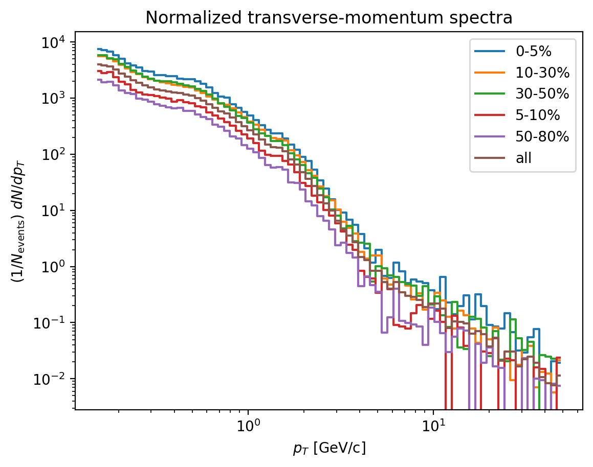
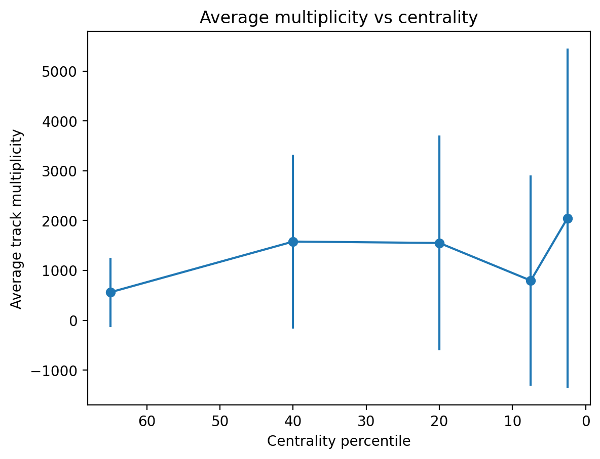
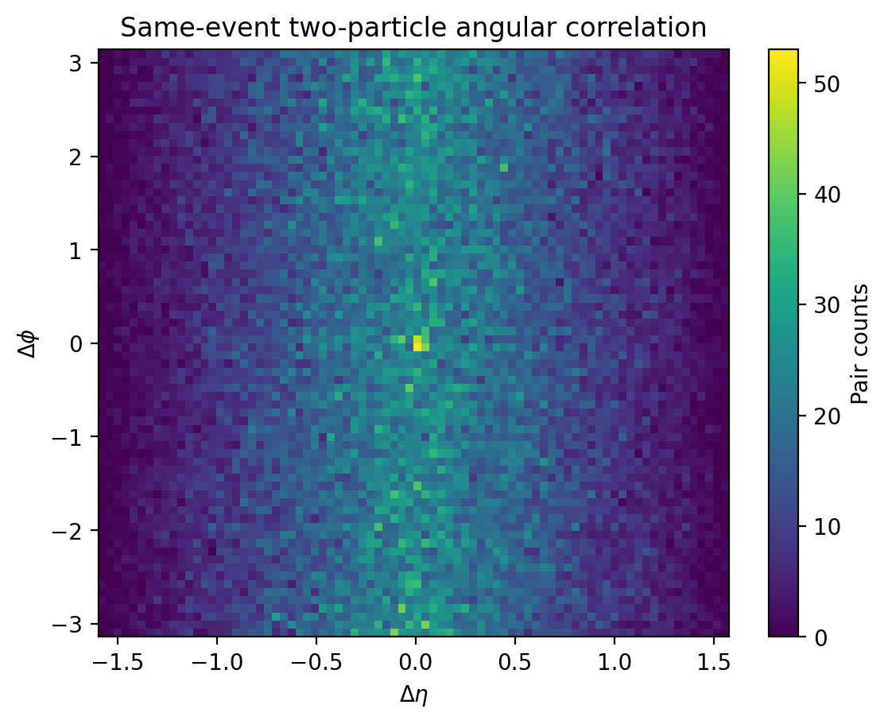

# Heavy-Ion Collision Analysis

This project analyzes ALICE Open Data from CERN heavy-ion collisions using
Python. It reads ROOT files with `uproot` and `awkward`, applies basic track
cuts, and produces physics-oriented plots and CSV tables.

> Disclaimer: this is an educational/exploratory analysis project, not an
> official ALICE result. The open data are released by CERN/ALICE for reuse, but
> neither CERN nor ALICE endorses independent analyses made with them.

The project has two entry points:

- `heavy_ion_alice_analysis.py`: command-line analysis pipeline
- `streamlit_dashboard.py`: interactive dashboard for demos and exploration

## Physics Background

### What is ALICE?

ALICE is one of the major experiments at CERN's Large Hadron Collider. It is
specialized for studying heavy-ion collisions, such as lead-lead collisions,
where extremely hot and dense nuclear matter is created for a very short time.

### What are heavy-ion collisions?

Heavy-ion collisions smash large atomic nuclei together at very high energies.
These collisions can create conditions similar to the early universe, shortly
after the Big Bang.

### What is quark-gluon plasma?

Quark-gluon plasma, or QGP, is a state of matter where quarks and gluons are no
longer confined inside protons and neutrons. Instead, they behave collectively
as a hot, dense medium. Heavy-ion observables such as multiplicity, transverse
momentum spectra, angular correlations, and flow coefficients help probe this
medium.

## Key Observables

### pT

`pT` means transverse momentum. It measures particle momentum perpendicular to
the beam direction. The pT spectrum tells us how particle production changes
from soft, bulk behavior to harder particle production.

### eta

`eta`, or pseudorapidity, describes a particle's angle relative to the beam
axis. The distribution `dN/deta` is a proxy for charged-particle density.

### phi

`phi` is the azimuthal angle around the beam axis. It is used for two-particle
correlations and flow observables such as `v2`.

### Centrality

Centrality is a percentile-like estimate of how head-on the collision was.
Small centrality values, such as `0-5%`, correspond to the most central
collisions. Larger values, such as `50-80%`, correspond to more peripheral
collisions.

### Multiplicity

Multiplicity is the number of reconstructed tracks in an event after cuts. It
is strongly related to collision geometry and centrality.

### v2{2}

`v2{2}` is a two-particle estimate of elliptic flow. It measures how strongly
particles prefer certain azimuthal directions. This project computes a starter
proxy using:

```text
v2{2} = sqrt(<cos(2 * (phi1 - phi2))>)
```

The implementation uses an efficient Q-vector identity rather than explicitly
looping over every track pair for the v2 calculation.

### Two-particle angular correlations

The project also creates a same-event pair-correlation histogram in:

```text
Delta eta = eta1 - eta2
Delta phi = phi1 - phi2
```

This can reveal near-side and away-side particle-correlation structures.

## Install

```bash
pip install -r requirements.txt
```

## Data

Put ALICE ROOT files into a local folder. These can come from CERN Open Data or
from an ALICE virtual-machine environment.

Useful starting points:

- ALICE dataset search on CERN Open Data:
  https://opendata.cern.ch/search?q=&f=type%3ADataset&f=experiment%3AALICE&l=list&order=desc&p=1&s=10&sort=mostrecent
- ALICE Open Data guide: https://opendata.cern.ch/docs/alice-getting-started
- Newer AO2D/O2 example dataset: https://opendata.cern.ch/record/11537
- Classic Pb-Pb ESD example dataset: https://opendata.cern.ch/record/1106
- Classic pp ESD example dataset: https://opendata.cern.ch/record/1111

For newer AO2D/O2 records, download an `AO2D.root` file or follow the record's
file index/download instructions. For classic ESD records, the ALICE Open Data
guide explains how the ALICE VM downloads files named `AliESDs.root`.

This project supports three ALICE input paths:

1. Newer ALICE AO2D/O2 files.
2. Classic AliRoot ESD files named like `AliESDs.root`, when run in a PyROOT +
   AliRoot environment.
3. Simpler tree-like ROOT files with explicit pT/eta/phi branches.

For AO2D files such as `AO2D.root`, leave the tree name blank. The script
auto-detects `DF_*/O2track` tables, derives:

- `pT` from `fSigned1Pt`
- `eta` from `fTgl`
- `phi` from `fAlpha` and `fSnp`
- centrality from `O2centrun2v0m` when available

For classic `AliESDs.root` files, use:

```bash
python heavy_ion_alice_analysis.py --data_dir /data/alice --file_format aliesd
```

AliESD support requires ROOT with ALICE AliRoot classes available, especially
`AliESDEvent`. This is usually provided by the ALICE Open Data VM or an ALICE
software environment. A plain `pip install -r requirements.txt` environment is
enough for AO2D files, but not enough for object-heavy AliESD files.

## Inspect a ROOT File

Different ALICE files can use different tree and branch names. First inspect
one file:

```bash
python heavy_ion_alice_analysis.py --data_dir /data/alice --max_files 1 --inspect
```

If automatic tree detection fails, pass the tree explicitly:

```bash
python heavy_ion_alice_analysis.py --data_dir /data/alice --tree_name "someTreeName;1"
```

## Run the Analysis

```bash
python heavy_ion_alice_analysis.py --data_dir /data/alice --max_files 5
```

Useful options:

```bash
python heavy_ion_alice_analysis.py \
  --data_dir /data/alice \
  --max_files 5 \
  --pt_min 0.15 \
  --pt_max 50 \
  --eta_abs_max 0.8 \
  --max_pair_events 500 \
  --max_pair_tracks 250 \
  --out_dir outputs
```

## Run the Dashboard

```bash
streamlit run streamlit_dashboard.py
```

The dashboard lets you choose:

- ROOT file folder
- number of files
- file format: `auto`, `ao2d`, `aliesd`, or `generic`
- optional tree name
- pT cuts
- eta cut
- AO2D event and TPC track-quality cuts
- pair-correlation sampling limits
- plot type

For your local AO2D test file, use:

```text
ROOT file folder: ./data
File pattern: *.root
Tree name: leave blank
Max events per file: 200 for a quick test, 0 for the full file
```

## Tests

Run the lightweight unit tests with:

```bash
python -m unittest discover -s tests
```

These tests use tiny synthetic in-memory events, so they do not require a local
ROOT file or downloaded ALICE data.

## Outputs

The command-line analysis writes plots and CSV tables to the output directory.
Each run also writes `validation_report.csv`, a conservative QA report that
marks which checks passed and which items still block final scientific claims.
The run also writes `reference_comparison.csv`, which compares raw project
mid-rapidity `dN/deta` values with the bundled ALICE Pb-Pb 5.02 TeV reference
table where centrality bins overlap.

## Example Output

These example plots were generated from an ALICE AO2D ROOT file using a
200-event quick test.

### Centrality-dependent dN/deta



### Centrality-dependent pT spectra



### Average multiplicity vs centrality



### Two-particle angular correlation



### Plots

- `eta_distribution.png`: normalized all-events dN/deta
- `pt_spectrum.png`: normalized all-events pT spectrum
- `event_multiplicity.png`: event multiplicity QA plot
- `dn_deta_by_centrality.png`: dN/deta split into centrality bins
- `pt_by_centrality.png`: pT spectra split into centrality bins
- `multiplicity_vs_centrality.png`: average multiplicity vs centrality
- `two_particle_correlation.png`: Delta eta / Delta phi pair histogram

### CSV tables

- `summary.csv`: overall event, track, cut, and v2 summary
- `dn_deta.csv`: normalized dN/deta table
- `pt_spectrum.csv`: normalized pT spectrum and invariant-yield proxy
- `centrality_summary.csv`: centrality-binned multiplicity and v2 summary
- `two_particle_correlation.csv`: pair-correlation histogram table, if phi exists
- `validation_report.csv`: provenance, QA, and scientific-validity checks
- `reference_comparison.csv`: comparison against bundled official ALICE
  mid-rapidity `dN/deta` values

## Notes and Limitations

This is still a starter analysis. It is designed to be robust across different
ALICE Open Data ROOT schemas, but publication-quality ALICE analysis requires
exact dataset-specific branch mappings, official-quality event and track
selection, detector efficiency corrections, acceptance corrections, reference
comparisons, and systematic studies. See `docs/VALIDATION.md`.

The `v2{2}` value shown by the app is a raw two-particle proxy. It is useful for
workflow checks, but it should not be presented as a final flow measurement
without nonflow studies, eta gaps or equivalent suppression, detector
corrections, and systematic uncertainties.

The bundled reference table in `references/` currently covers only ALICE
primary charged-particle `dN/deta` in `|eta| < 0.5` for Pb-Pb at 5.02 TeV. The
comparison is a QA guardrail for the raw project output; it is not a substitute
for detector corrections or a full ALICE analysis chain.

Pair correlations can become expensive for high-multiplicity events, so the
script uses `--max_pair_events` and `--max_pair_tracks` to keep the workflow
fast enough for exploratory analysis.
